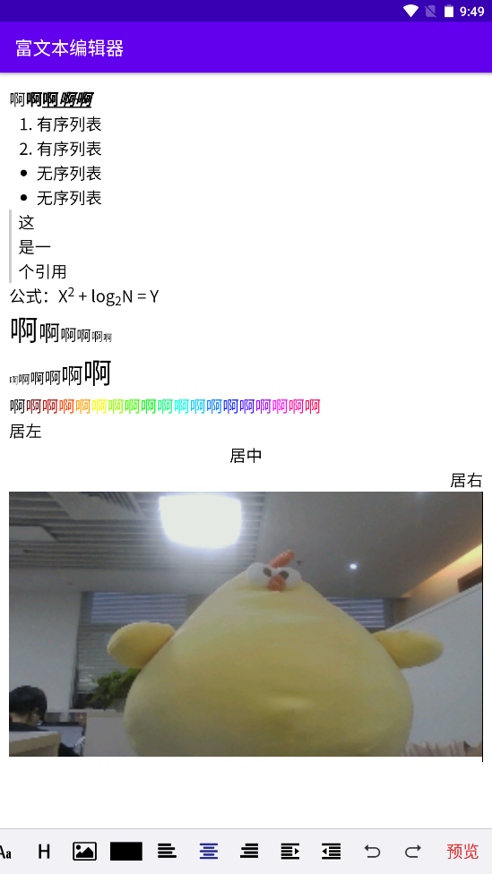

# Android富文本编辑器 #
WebView + JavaScript 的方式实现一个android富文本编辑器

## 前言 ##
>衷心感谢 [**原作者**][author]/[**github**][github] 的开源。  
在原作的基础上添加了字体大小、图片选择、撤回重做等功能。  
添加了二级菜单，优化了原来的代码逻辑，去掉繁杂的if条件判断。  
修复引用、字体上标、字体下标无限套娃的问题。  
实时读取光标所在位置的输入状态并回显到编辑器底部的操作按钮上。

## 演示 ##
### 基本功能 ###

### 选择图片/拍照 ###

## 留言 ##
### 图片上传 ###
>目前的图片是采用base64的形式存在富文本编辑器里面。  
推荐改成上传到服务器后传url形式展示图片，防止html过大导致提交速度变慢。

### 光标定位问题 ###
>诸如有序列表、无序列表、引用等功能，在没有内容的时候取消状态会出现光标移动到最上方的情况，
这是因为没有获取到光标所在位置的html元素，目前没找到什么比较好的办法，希望有大佬提供解决方案，
万分感谢！

### 其他问题 ###
>如果遇到什么问题，欢迎提issues，感谢使用！

[author]: https://www.jianshu.com/p/9c2c1416d894
[github]: https://github.com/ZQ330093887/RichEditotAndroid