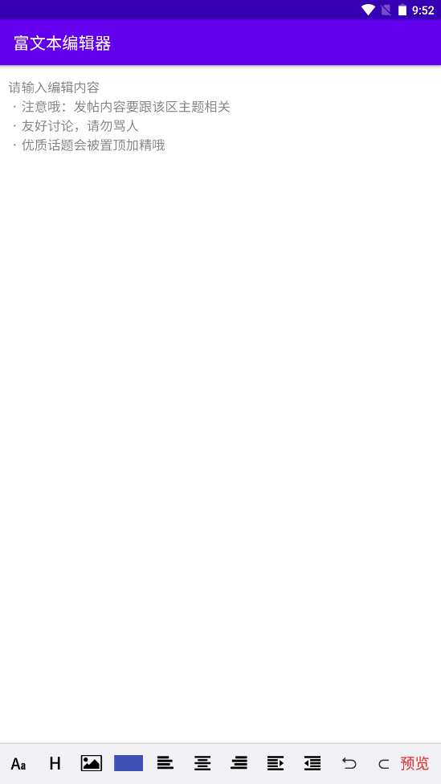

# Android富文本编辑器 #
WebView + JavaScript 的方式实现一个android富文本编辑器

## 前言 ##
>衷心感谢 [**原作者**][author]/[**github**][github] 的开源。  
在原作的基础上添加了字体大小、图片选择、撤回重做等功能。 
并添加了二级菜单，优化了原来的代码逻辑，去掉繁杂的if条件判断。

## 演示 ##
### 页面展示 ###

### 基本功能 ###

### 选择图片/拍照 ###

[author]: https://www.jianshu.com/p/9c2c1416d894
[github]: https://github.com/ZQ330093887/RichEditotAndroid